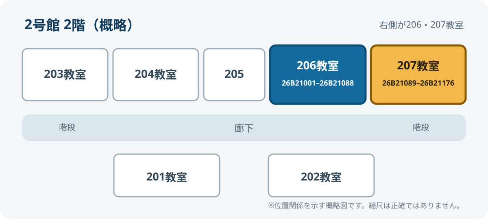

## 教科ガイダンス

  
日時<strong>9月14日（月）10:00–12:00</strong>

  
場所<strong>実籾キャンパス 2号館2階</strong>

### 学生番号別の教室

| 学生番号 | 教室 |
|---|---|
| **26B21001–26B21088** | **2号館2階 206教室** |
| **26B21089–26B21176** | **2号館2階 207教室** |

::: {.callout-important title="教室を間違えないようにしてください"}
学生番号の末尾だけでなく、学生番号全体がどちらの範囲に入るかを確認してください。206・207教室はいずれも2号館2階の右側です。
:::

{.floor-map fig-alt="2号館2階の概略図。上側の右寄りに206教室、その右隣に207教室がある。"}

[教室配置図を大きく開く](assets/building2-2f.svg){.image-open-link target="_blank" rel="noopener"}

### 当日の目的

- 前期（1Q・2Q）の成績を確認する
- 3Q・4Qの時間割作成シートを完成させる
- 帰宅後、ポータルから履修登録する

::: {.callout-note title="ポータルのパスワードについて"}
この公開サイトには初期パスワードの規則を掲載しません。ログインできない場合は、大学の正規の案内または窓口で確認してください。
:::

## クラス分け表

<section class="box-panel compact" aria-labelledby="box-heading-guidance">

Box上のファイルが最新版です

<h3 id="box-heading-guidance">科目ごとのクラス分け</h3>

ガイダンス教室の割り当てとは別に、授業科目ごとのクラス分けを確認してください。

 更新：

<a class="box-button" data-box-link href="" target="_blank" rel="noopener">Boxでクラス分け表を開く</a>
</section>

Boxのファイルが更新された場合も、同じボタンから最新版を確認できます。

## 履修相談

  
日時<strong>9月16日（水）13:00–14:30</strong>

  
最終受付<strong>14:00</strong>

  
場所<strong>実籾キャンパス 2号館2階 206教室</strong>

::: {.callout-warning title="ノートパソコンを持参してください"}
履修登録はWeb上で行います。相談したい内容と、作成途中の時間割も準備しておくと確認がスムーズです。
:::

### 相談前に用意するもの

**必須**

- ノートパソコン
- ポータルへログインできる状態

**あるとよいもの**

- 学生証
- 時間割作成シート
- 履修したい科目と、迷っている点のメモ

[履修登録のルールを確認する](registration.qmd){.btn .btn-primary}
