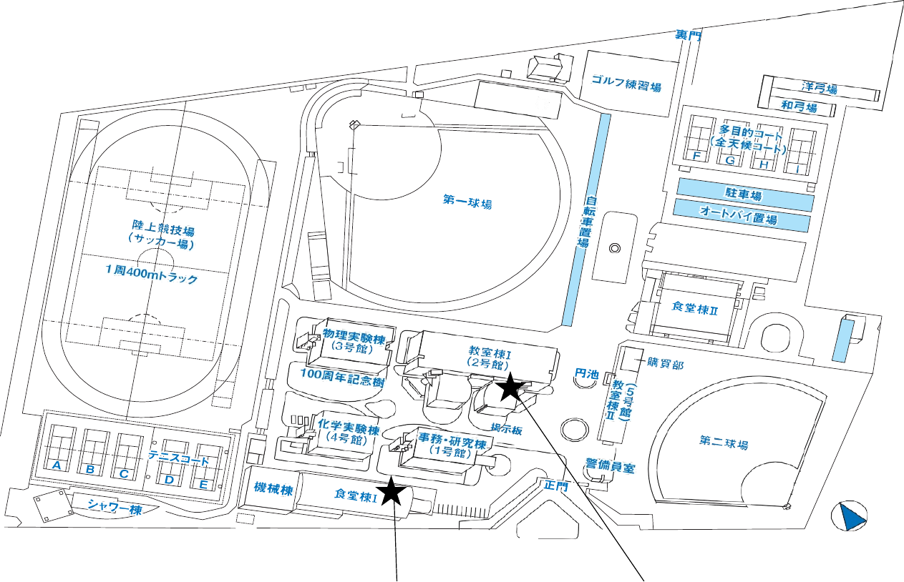

  
実籾校舎の販売期間<strong>9月24日（木）–30日（水）</strong>

  
実籾校舎の販売時間<strong>8:30–16:30</strong>

  
実籾校舎の休業日<strong>土曜日・日曜日</strong>

::: {.callout-warning title="電気数学Ⅰの教科書は津田沼校舎のみ"}
「電気数学Ⅰ」の教科書『物理入門コース 新装版 物理のための数学』（2,860円）は、**津田沼校舎のみで販売**されます。
:::

上記の日程と時間は**実籾校舎の販売情報**です。電気数学Ⅰの津田沼校舎での販売日時・場所は、この資料には記載されていないため、大学からの最新案内を確認してください。

**4Qで使用する教科書も販売期間中に購入してください。** 販売期間外には購入できません。同じ科目名でも担当教員によって教科書が異なる場合があるため、**購入前にシラバスを確認してください。**

<nav class="page-shortcuts" aria-label="教科書の確認項目へ移動">
<a href="#実籾校舎の販売場所">販売場所・案内図</a>
<a href="#学生談話室で販売する教科書">学生談話室の価格一覧</a>
<a href="#自習室で販売する教科書">自習室の価格一覧</a>
</nav>

## 実籾校舎の販売場所

| 販売場所 | 建物・教室 |
|---|---|
| 学生談話室 | 食堂棟Ⅰ 1階 |
| 自習室 | 2号館1階 102室 |

{.campus-map fig-alt="実籾キャンパス案内図。黒い星で、南側の食堂棟Ⅰと中央の教室棟Ⅰ（2号館）が示されている。"}

[キャンパス案内図を大きく開く](assets/mimomi-campus-map-2026.png){.image-open-link target="_blank" rel="noopener"}

<strong>★ 食堂棟Ⅰ 1階</strong> 学生談話室

<strong>★ 2号館 1階102室</strong> 自習室

## 学生談話室で販売する教科書

学生談話室の教科書名・価格一覧（英語・数学・語学など）

| 科目名 | 教科書名 | 価格（税込） |
|---|---|---:|
| 英語Ⅰ・Ⅱ | Unlock Level 2 Reading, Writing & Critical Thinking, 3rd Edition | 3,960円 |
| 英語Ⅰ・Ⅱ | Unlock Level 2 Listening, Speaking & Critical Thinking, 3rd Edition | 3,960円 |
| 英語Ⅱ（Glo-BE、平塚先生・皆川先生） | 公式TOEIC L&R問題集12 | 3,630円 |
| 微分積分学Ⅰ・Ⅱ | 計算力をつける微分積分 | 2,200円 |
| 微分積分学Ⅰ・Ⅱ、数学演習Ⅰ（S）・Ⅱ（S） | 計算力をつける微分積分 問題集 | 1,320円 |
| 基礎科学演習 | 基礎数学：式計算から微積の初歩まで | 1,760円 |
| 線形代数学 | 理工系の数理 線形代数 | 2,530円 |
| 物理学Ⅰ・物理学Ⅱ（三角先生） | 物理学基礎 第5版（Web動画付） | 2,640円 |
| 初習外国語 ドイツ語（栁先生） | 初歩ドイツ語文法 | 1,100円 |
| 初習外国語 フランス語（安室先生） | ル・フランセ・クレール（三訂版） | 2,530円 |
| 初習外国語 中国語（髙橋先生） | はじめよう楽々中国語 新版 | 2,420円 |

## 自習室で販売する教科書

自習室の教科書名・価格一覧（社会学・化学・実験など）

| 科目名 | 教科書名 | 価格（税込） |
|---|---|---:|
| 社会学（大西先生） | DO！ソシオロジー | 1,980円 |
| 日本語表現法（清水先生・大内先生） | 日本語表現法：思考力を鍛える | 1,980円 |
| 化学（三木先生・松本先生ほか） | 2026年・化学 | 400円 |
| 物理学Ⅰ（大熊先生） | 理工系 基礎力学 | 2,200円 |
| 科学基礎実験A（大熊先生・岡野先生・塩見先生・姫本先生・三角先生・山城先生） | 科学基礎実験A | 2,000円 |

::: {.source-note}
価格・取扱場所は配布資料に基づきます。変更の案内が出た場合は、大学の最新情報を優先してください。
:::
